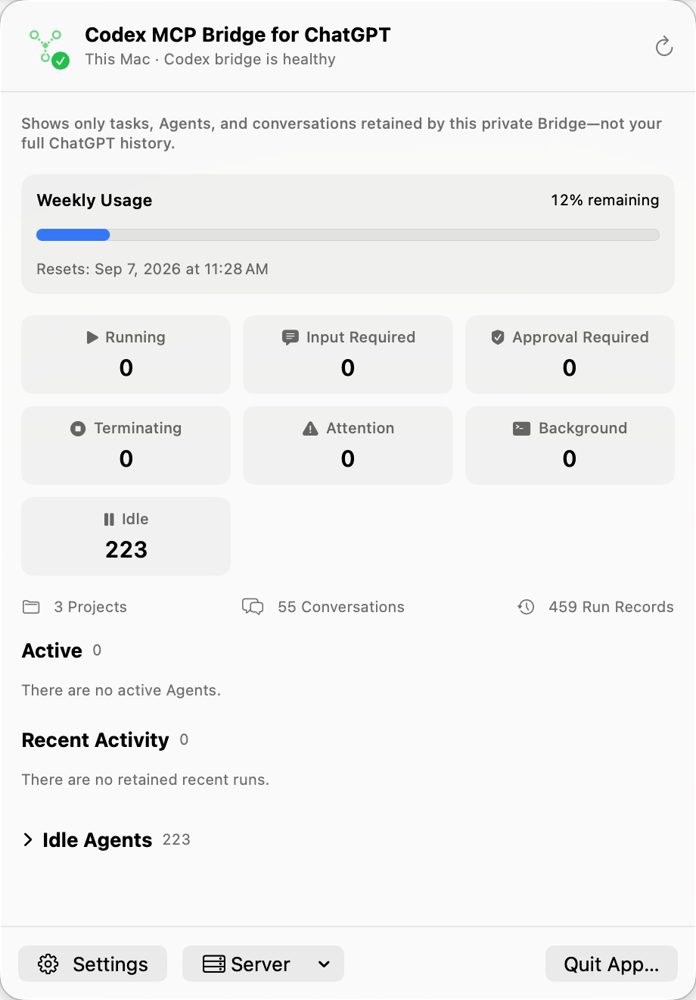
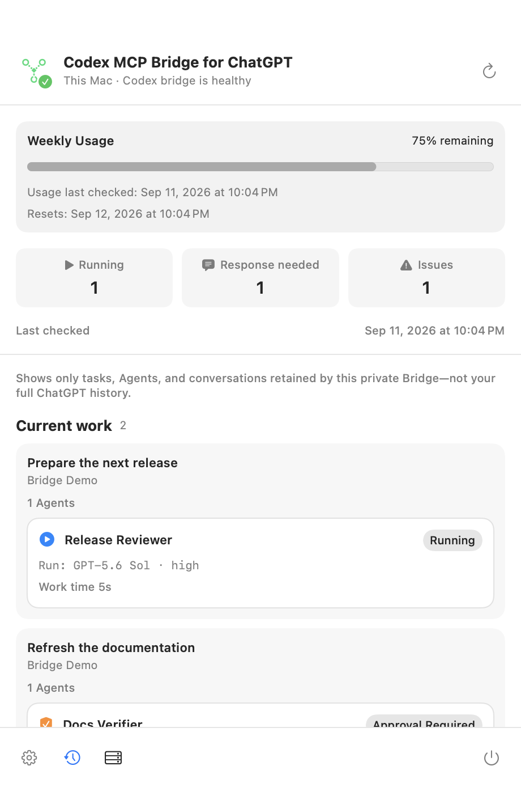
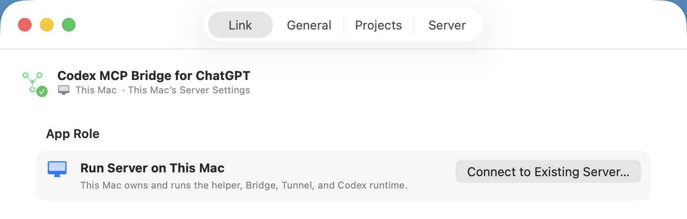
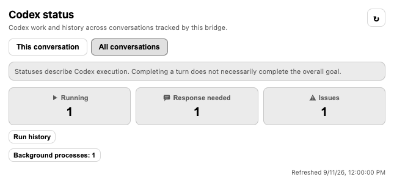
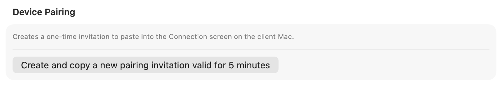

# Codex MCP Bridge for ChatGPT

Use ChatGPT to run Codex against projects on your own computer, keep work organized, and check progress without repeatedly copying commands and results between apps.

[Download releases](https://github.com/menaje/codex-mcp-bridge-for-chatgpt/releases) · [Detailed setup guide](docs/setup.md) · [Security model](docs/security.md)

## What it gives you

- Run and continue local Codex work from a ChatGPT conversation.
- Organize work as reusable Agents and goal-oriented Activities instead of isolated terminal calls.
- See running work, requests needing a response, and problems from the native macOS menu-bar app or the ChatGPT status card. Select a count to filter the current work and run history. The card starts with this conversation when it has retained work, with a switch to all conversations.
- Choose which project folders Codex may use and control model, reasoning, concurrency, and access policy centrally.
- Run one Mac as the server and use another Mac as a client for status and settings.
- Keep the normal starting policy read-only and place an operator-controlled ceiling on broader access.

```text
ChatGPT
  → OpenAI Secure MCP Tunnel
  → Codex MCP Bridge for ChatGPT on your server computer
  → Codex working in a registered project folder
```

## What the menu-bar app shows

On macOS, open the menu-bar icon to check the selected server without opening ChatGPT:

- **Connection and Codex usage:** server/client target, Bridge health, and—when available—weekly Codex usage remaining with its reset time.
- **Work state:** running, input required, approval required, terminating, attention, background, and idle counts.
- **Activity details:** registered projects, tracked conversations, run records, active/recent/idle Agents, model, reasoning effort, work time, and background processes.
- **Quick actions:** refresh status, open a Codex conversation, open Settings, control the server, or quit the app.

<p align="center">
  
  
</p>

## Choose how to use it

| Your situation | Recommended setup | What runs on this computer |
| --- | --- | --- |
| This Mac will run Codex work | macOS app in **Run Server on This Mac** mode | App, helper, Bridge, Tunnel, and Codex |
| This Mac will only manage another Mac | macOS app in **Connect to Existing Server** mode | Client app only |
| Windows or Linux will run Codex work | Node.js server | Bridge, Tunnel, and Codex |
| macOS without the native app | Node.js server | Bridge, Tunnel, and Codex |

The native client-only mode is currently available on macOS. Windows and Linux users run the Node.js server and use the ChatGPT Settings and Dashboard cards.

<p align="center">
  
</p>

## Quick start

### macOS app

1. Download the DMG for your Mac from [Releases](https://github.com/menaje/codex-mcp-bridge-for-chatgpt/releases): `arm64` for Apple Silicon or `x64` for Intel.
2. Move **Codex MCP Bridge for ChatGPT** to Applications and open it.
3. Choose one role:
   - **Run Server on This Mac** to run Codex locally.
   - **Connect to Existing Server** to use this Mac only as a client.

Server mode requires macOS 13 or later, Node.js 22 or later, and `tunnel-client`. In **Settings → Codex**, use an existing app/terminal Codex or install a bridge-managed CLI. A single existing installation is selected automatically; saved choices and manual update preferences are preserved. The app guides you through the Tunnel runtime key, Tunnel ID, Codex browser login, and first project.

The bridge connects directly to the selected Codex through App Server. See [Codex installation and updates](docs/codex-runtimes.md) for ownership, compatibility, authentication and recovery.

Client mode does not start or require a local Bridge, Tunnel, or Codex runtime. Paste the one-time invitation copied from the server Mac, then select that saved server.

The current app is ad-hoc signed and not notarized. On first launch, macOS may require approval in **System Settings → Privacy & Security**.

### Windows, Linux, or a terminal-managed server

Install Node.js 22 or later, the Codex CLI, and `tunnel-client`, then authenticate Codex:

```bash
codex login
git clone https://github.com/menaje/codex-mcp-bridge-for-chatgpt.git
cd codex-mcp-bridge-for-chatgpt
npm ci
npm run build
```

Copy `.env.example` to the private runtime configuration location, set `CONTROL_PLANE_API_KEY` and `CONTROL_PLANE_TUNNEL_ID`, then start the server:

```bash
npm run bridge:secure
```

Use `npm run bridge:local` only for loopback development. ChatGPT access normally uses the Secure MCP Tunnel. See the [detailed setup guide](docs/setup.md) for Linux/macOS shell commands, Windows PowerShell commands, and configuration locations.

## Connect it to ChatGPT

After the server reports that the Bridge and Tunnel are ready:

1. Enable Developer mode in ChatGPT.
2. Create a developer-mode connection and choose Secure MCP Tunnel.
3. Select the Tunnel ID used by the server.
4. Choose **No Auth** for the ChatGPT connection.
5. Ask ChatGPT to open the bridge settings and register at least one project folder.

Routine computer, app, Bridge, or Tunnel restarts do not require a ChatGPT connection refresh. Refresh the connection after installing a release that changes tools or card UI.

<p align="center">
  
</p>

## Settings at a glance

| Area | What it controls |
| --- | --- |
| Connection | This Mac's server/client role, saved servers, remote access, and device pairing |
| General | Access strategy, model policy, Priority/Fast use, language, concurrent work, and card behavior |
| Projects | The folders Codex may use for new work |
| Server | Codex backend and the maximum access the server may grant |

General settings are saved automatically and are shared by every ChatGPT conversation using that server. In client mode, General and Projects edit the selected remote server. The login-at-startup preference always belongs to the current Mac. Server settings require an explicit save and restart.

For every option and its effect, see [Setup and settings](docs/setup.md#settings-reference).

## Remote client mode

On the server Mac, open **Settings → Connection**, enable **Manage This Server from Another Mac**, and select **Create and copy a new pairing invitation valid for 5 minutes**. Paste that invitation into the client Mac. It contains the server address and security identity together, expires after five minutes, and can be used once.

<p align="center">
  
</p>

You can save more than one server on the client, but only one is active at a time. Switching servers changes the Dashboard and the target of shared settings. A project path entered on a client is always a path on the selected server.

Use remote management only on a private LAN or private VPN that you control. See [Remote client mode](docs/remote-client.md) for the network and security boundaries.

## Safety notes

- The Bridge binds to loopback by default and begins with read-only access.
- Project folders must be registered explicitly; the Bridge does not guess a working folder.
- Broader write or full access must be allowed by the server before a task can use it.
- This is a personal bridge for one trusted operator. Shared settings are not isolated by ChatGPT account.
- These controls are policy boundaries, not operating-system isolation. Use a separate OS user, container, VM, or disposable project copy when stronger isolation is required.
- Execution uses the selected Codex CLI through App Server. Compatibility depends on the public protocol and required features, without a bridge-owned version allowlist.

## Documentation

- [Setup and settings](docs/setup.md) — macOS server/client setup, Windows/Linux Node.js setup, ChatGPT connection, and every user-facing setting
- [Native macOS app](docs/macos-app.md) — app architecture, lifecycle, local files, recovery, and build details
- [Remote client mode](docs/remote-client.md) — pairing, server switching, network scope, and credential handling
- [ChatGPT integration](docs/chatgpt-setup.md) — advanced plugin contracts, refresh behavior, orchestration, and smoke checks
- [Security model](docs/security.md) — trust boundaries, authentication, access policy, and remaining risks
- [Input contracts](docs/input-contracts.md) and [output contracts](docs/output-contracts.md) — public and app-private protocol details
- [Release process](docs/releasing.md) and [release governance](docs/release-governance.md) — maintainer workflow and distribution gates

## Development

```bash
npm ci
npm run check
```

On macOS:

```bash
npm run macos:check
npm run macos:bundle
```

Release identity and supported targets are defined in `release-manifest.json`. Historical attribution is in [UPSTREAM.md](UPSTREAM.md).

## License

MIT

GPT handles ordinary Codex questions through `codex_status` (input query) and `codex_answer`. When the user’s opinion is needed, GPT can open a question card with `codex_ask_user` and retrieve the response with `codex_user_answer`. See [question orchestration](docs/gpt-questions.md) for the protocol, retention policy, and host validation limits.

The current card/tool consolidation and retained-card migration are described in [Card tools](docs/card-tools.md). Activity screens are retired for new work; open the status card for this conversation or all work and work details.
