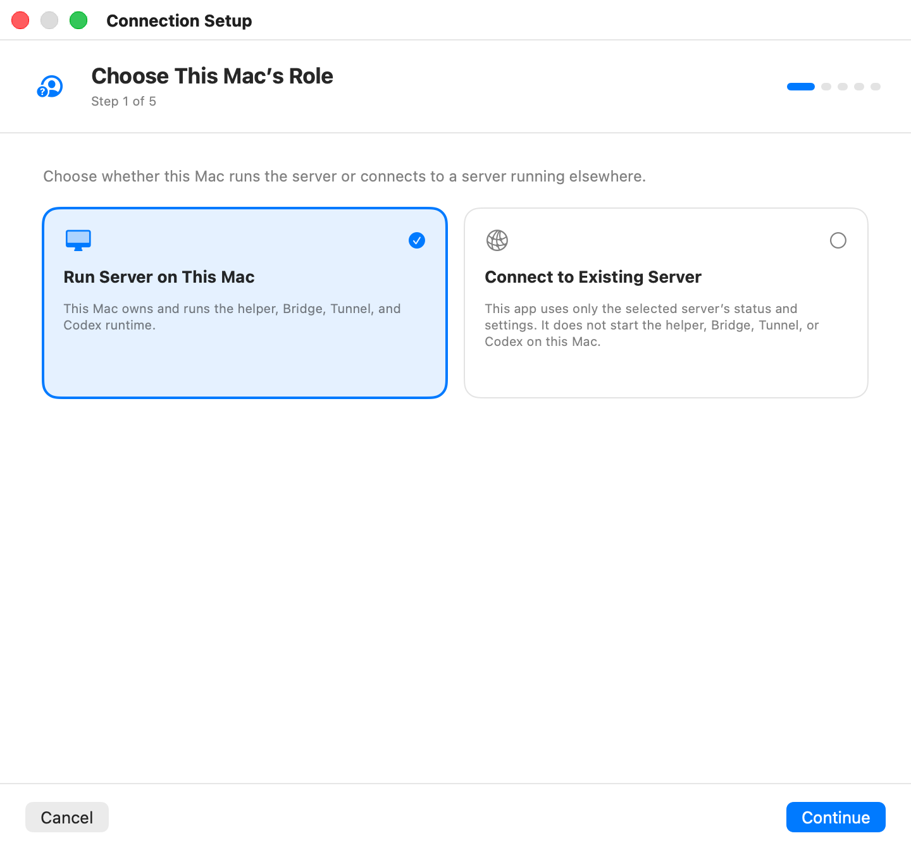
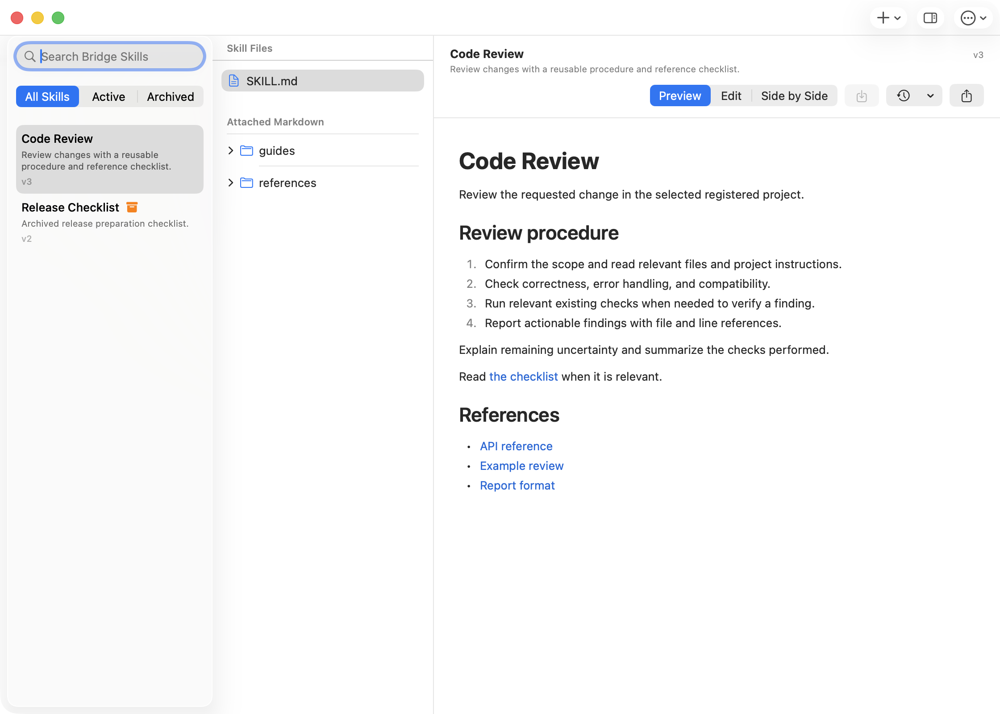
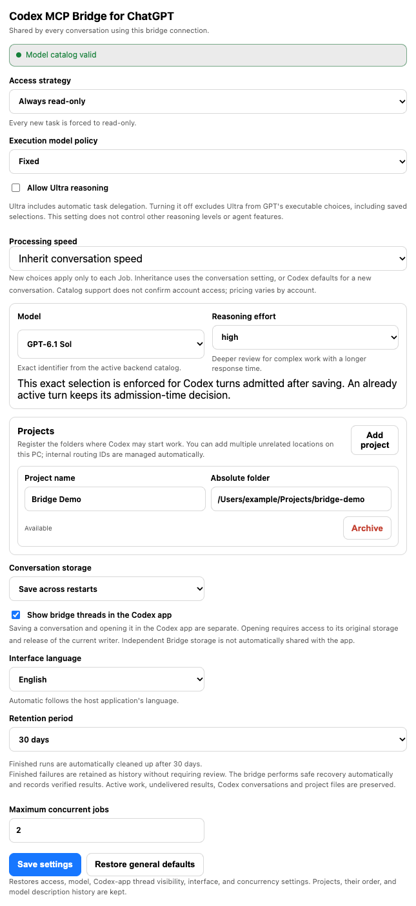
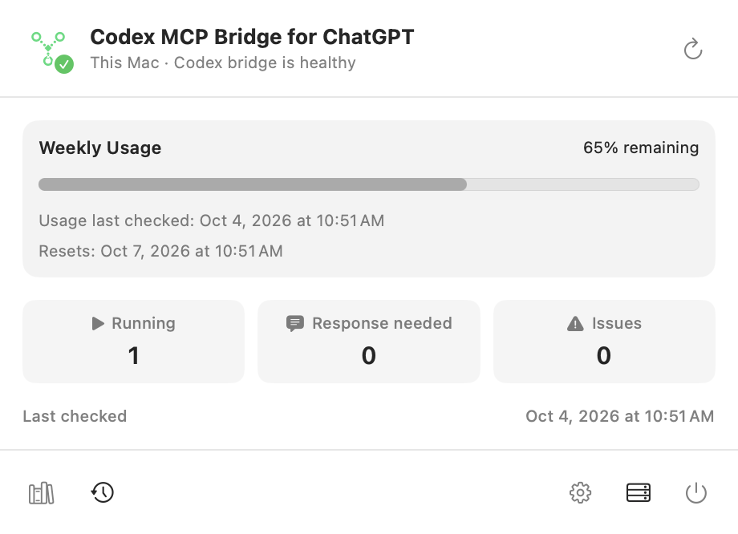
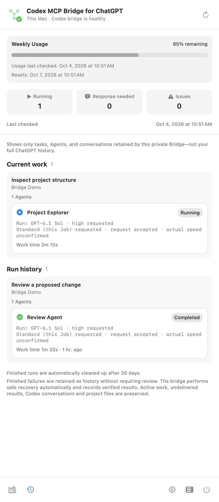

# Codex MCP Bridge for ChatGPT

Use ChatGPT to work with Codex on your own computer. Register your projects, reuse your working procedures, continue existing work, and check progress from ChatGPT or the native macOS menu-bar app.

[Download releases](https://github.com/menaje/codex-mcp-bridge-for-chatgpt/releases) · [Setup guide](docs/setup.md) · [Skill library](docs/skills.md) · [Security model](docs/security.md)

This README and its screenshots describe the current **development branch**. A downloaded release can have different features and screens; use the README at that release's Git tag. The latest published stable release as of October 4, 2026 is [v0.4.1](https://github.com/menaje/codex-mcp-bridge-for-chatgpt/tree/v0.4.1). A development build can retain the same product version while its features change.

## What you can do

- **Work on local projects from ChatGPT.** Ask Codex to inspect a registered folder, make an approved change, or continue an existing Agent. Activities group work around a goal; Agents keep execution context; Jobs record individual runs.
- **Reuse your procedures.** Keep review checklists, release instructions, and reference Markdown in the Bridge skill library. Import a folder or ZIP, edit the source, and restore earlier versions.
- **Choose your installation and account.** Use an existing Codex installation or a Bridge-managed CLI, and choose an existing login, a separate ChatGPT login, or a Bridge API-key connection.
- **Control model and execution settings.** Choose fixed or automatic model selection, edit model descriptions with version history, select processing speed, and set access and concurrency limits.
- **Keep track of work.** See running work, questions, approvals, issues, retained runs, and available account usage. Save new conversations across restarts and choose app visibility separately.
- **Manage another Mac.** Pair a client Mac with a server on your private LAN or VPN and switch between saved servers.

```text
ChatGPT
  → OpenAI Secure MCP Tunnel
  → Bridge on your server computer
  → Codex in a registered project folder
```

## Choose a setup

| Your situation | Setup | What runs on this computer |
| --- | --- | --- |
| This Mac will run Codex | macOS app: **Run Server on This Mac** | App, helper, Bridge, Tunnel, and Codex |
| This Mac will manage another Mac | macOS app: **Connect to Existing Server** | Client app only |
| Windows or Linux will run Codex | Node.js server | Bridge, Tunnel, and Codex |
| Mac managed from a terminal | Node.js server | Bridge, Tunnel, and Codex |

The native app requires macOS 13 or later. Server setups also need Node.js 22 or later, `tunnel-client`, an OpenAI Secure MCP Tunnel, and authenticated Codex. A client-only Mac needs the app and a pairing invitation. See [prerequisites and setup paths](docs/setup.md#what-you-need).

## Get started

### macOS app

1. Download the DMG matching your Mac from [Releases](https://github.com/menaje/codex-mcp-bridge-for-chatgpt/releases): `arm64` for Apple Silicon or `x64` for Intel. For the development screens shown here, [build the current app from source](#development).
2. Move **Codex MCP Bridge for ChatGPT** to Applications and open it.
3. Choose **Run Server on This Mac**. The assistant checks existing connection settings before asking for a Tunnel runtime key and Tunnel ID.
4. In **Codex Account & Installation**, explicitly select an existing installation or install a Bridge-managed CLI, then choose and verify an authentication connection.
5. Register your first existing project folder and confirm that the Bridge and Tunnel are ready.

<p align="center">
  
</p>

The app is ad-hoc signed and not notarized. macOS may require approval in **System Settings → Privacy & Security** on first launch. Setup, installation ownership, and manual updates are covered in [Setup](docs/setup.md#macos-server-mode) and [Codex installations](docs/codex-runtimes.md).

For a client-only Mac, choose **Connect to Existing Server** and paste the server Mac's invitation. Follow [remote client setup](#manage-another-mac).

### Windows, Linux, or a terminal-managed server

Install [Node.js 22 or later](https://nodejs.org/en/download), the [Codex CLI](https://learn.chatgpt.com/docs/cli), and [`tunnel-client`](https://developers.openai.com/api/docs/guides/secure-mcp-tunnels#set-up-tunnel-client). Authenticate the CLI in the Codex home you intend this server to use. A new login in a shared home can affect other Codex clients; see [authentication connections](docs/codex-auth-connections.md).

For the development branch documented here:

```bash
git clone --branch dev https://github.com/menaje/codex-mcp-bridge-for-chatgpt.git
cd codex-mcp-bridge-for-chatgpt
npm ci
npm run build
```

Create the private runtime configuration outside your project folders, using the [shell or PowerShell instructions](docs/setup.md#nodejs-server-on-windows-or-linux). Set `CONTROL_PLANE_API_KEY` and `CONTROL_PLANE_TUNNEL_ID`, then start:

```bash
npm run bridge:secure
```

Keep this process running. `npm run bridge:local` is for loopback development. Windows and Linux use the ChatGPT Settings and Dashboard cards for ordinary management.

### Connect to ChatGPT

1. Associate your Tunnel with the target ChatGPT workspace in [Platform tunnel settings](https://platform.openai.com/settings/organization/tunnels).
2. Enable **Developer mode** in ChatGPT **Settings → Security and login**. Workspace policy can control access.
3. Open [ChatGPT Plugins](https://chatgpt.com/plugins), create a developer connection, and choose **Connection → Tunnel**.
4. Select or enter the server's Tunnel ID and choose **No Auth** for the ordinary Bridge connection.
5. Add the connection in a new ChatGPT conversation and ask it to open Bridge settings. Register a project if you have not already done so.

Tunnel creation needs **Read + Manage** permission; running or selecting it needs **Read + Use**. Follow the [official Tunnel guide](https://developers.openai.com/api/docs/guides/secure-mcp-tunnels) if the Tunnel is absent. Refresh the connection after an upgrade that changes tools, authentication, or card UI; close old cards and reopen the current ones. Routine restarts with the same build do not require Refresh.

## Try your first task

Use the exact name of a registered project. For a project named **Bridge Demo**, start with:

> Use Codex to inspect the registered project "Bridge Demo". Explain its structure and suggest one small improvement. Keep this task read-only.

Then continue the existing context:

> Continue the same Agent and investigate the improvement you suggested. Explain which files would change and how to verify it.

For an implementation, first allow the required access in Bridge settings and the server's access ceiling, then approve the specific change. You can also ask:

> What is the status of this work?
>
> Open the Codex Dashboard so I can see running work and run history.

ChatGPT follows the same Job while it runs, asks for needed decisions in the conversation, and reads the original result before continuing approved work. Closing a screen or losing a connection does not cancel Codex. Return to the originating conversation and ask to read the existing work before starting anything again. See [task and result recovery](docs/chatgpt-setup.md#5-use-the-current-task-contract).

For a complex comparison, ChatGPT can prepare a [standalone decision HTML file](docs/standalone-decision-html.md). Return your chosen summary to the conversation to continue.

## Reuse procedures with the skill library

Bridge skills store your instructions as `SKILL.md` with optional reference Markdown files. ChatGPT searches and reads the selected version, then applies the procedure to your request. Reading a skill does not start Codex or change task permissions.

1. Open the macOS menu-bar popover and select **Skill Library** (the book icon).
2. Create a skill, or import a Markdown file, folder, or ZIP. Review the proposed content and files before saving.
3. Preview or edit the complete source. Each save creates a version; use version history to restore an earlier snapshot or export it as a ZIP.
4. Ask ChatGPT to find and use it, for example:

> Find the Bridge skill "Code Review" and read it and its checklist. Use that procedure to review the registered project "Bridge Demo", then report the findings here.

<p align="center">
  
</p>

Use **Import into Current Skill** to add files to an existing skill. Dropping a folder or ZIP creates a new-skill import. Archive hides a skill from discovery while keeping its versions. See [the first-skill walkthrough](docs/skills.md#create-and-use-your-first-skill) for sample content and management details.

## Choose settings for your work

The native Settings sidebar separates General, Models & Execution, Projects, Codex Account & Installation, Connection, and Server. Shared changes save automatically in the native app; the ChatGPT card uses **Save settings**. Server limits use an explicit apply and restart.

| Setting | How it helps |
| --- | --- |
| Codex installation and authentication | Choose the executable separately from its account. Reuse an existing login, prepare a separate ChatGPT login, or explicitly select API billing. |
| Fixed or automatic model | Keep one model/effort pair, or let ChatGPT choose within your allowed catalog. In automatic mode, edit model descriptions and restore earlier descriptions from history. |
| Processing speed | Inherit the conversation speed, select Standard, Fast, or Ultrafast for each new Job, or preserve earlier settings. Availability depends on the selected model, CLI, and account. |
| Conversation storage | Save new conversations across restarts or use memory-only context. App visibility is a separate choice; opening a conversation also needs accessible original storage and a released connection. |
| Projects and history | Rename, relocate, archive, or restore registrations without moving project files. Recover deleted registrations that still own resumable work. Choose a run-history retention period. |
| Language and concurrency | Apply an explicit language to the app and cards and limit concurrent Jobs. Automatic language follows the host showing each surface. |

<p align="center">
  
</p>

<p align="center">
  
</p>

See [all settings](docs/setup.md#settings-reference), [authentication connections](docs/codex-auth-connections.md), [model descriptions](docs/model-selection.md#user-model-descriptions), and [processing speed](docs/processing-speed.md#choose-a-speed).

## Check work and usage

Open the menu-bar icon for server health, available weekly Codex usage, and **Running / Response needed / Issues** counts. Select a count to filter current work; **Work & Run History** opens retained runs. Refresh explicitly to get a new snapshot.

<p align="center">
  
  
</p>

The ChatGPT Dashboard switches between **This conversation** and **All conversations**. It shows retained work known to this Bridge, available weekly usage, questions, approvals, and run history. Execution details distinguish requested settings, accepted requests, and any server-confirmed values; an accepted request does not prove the actual processing speed.

<p align="center">
  
</p>

The Dashboard opens when requested. It manages and displays work without sending results into the chat or starting automatic followups. Read more about [questions](docs/gpt-questions.md), [history](docs/work-history.md), and [conversation handoff](docs/thread-lifecycle.md).

## Manage another Mac

On the server Mac, open **Settings → Connection**, enable **Manage This Server from Another Mac**, and create a pairing invitation. Paste it on the client Mac. It includes the server address and security identity, expires after five minutes, and can be used once.

<p align="center">
  
</p>

Only one saved server is active at a time. Switching changes the source of status and shared settings. Project paths refer to folders on that server. Use a private LAN or VPN you control; see [remote client mode](docs/remote-client.md).

## Access and safety

- The Bridge begins with read-only access and binds to loopback by default.
- Register each permitted project folder explicitly. Keep runtime credentials outside those folders.
- Write or full access requires the server to allow it; settings cannot exceed that ceiling.
- The Bridge is for one trusted operator. Shared settings are not isolated by ChatGPT account.
- For stronger isolation, use a separate OS user, container, VM, or disposable project copy.

[MCP Events](docs/mcp-events.md) is a separate experiment disabled by default. Ordinary setup and approved followups use the normal conversation path. See [security boundaries](docs/security.md) before broadening access.

## Documentation

| Guide | Contents |
| --- | --- |
| [Setup and settings](docs/setup.md) | Prerequisites, platform setup, first task, and every user-facing setting |
| [Bridge skill library](docs/skills.md) | Create, import, use, version, restore, and export reusable procedures |
| [Codex installations](docs/codex-runtimes.md) and [authentication](docs/codex-auth-connections.md) | CLI ownership, manual updates, account choices, storage, and billing |
| [Model selection](docs/model-selection.md) and [processing speed](docs/processing-speed.md) | Allowed models, description history, speed scope, and execution evidence |
| [Native macOS app](docs/macos-app.md) and [remote client](docs/remote-client.md) | Native settings, lifecycle, pairing, and recovery |
| [ChatGPT integration](docs/chatgpt-setup.md) and [card tools](docs/card-tools.md) | Connection refresh, task contracts, questions, and smoke checks |
| [Security](docs/security.md), [database](docs/database-schema.md), and [recovery](docs/state-upgrade-recovery.md) | Trust boundaries, retained data, backups, and upgrades |
| [MCP migration](docs/mcp-2026-07-28-migration.md), [input](docs/input-contracts.md), and [output](docs/output-contracts.md) | Current protocol and tool contracts |
| [UI releases](docs/ui-release-compatibility.md), [release process](docs/releasing.md), and [governance](docs/release-governance.md) | Card cache behavior, validation, and distribution gates |
| [Localization](docs/localization.md) and [text integrity](docs/text-integrity.md) | Translation source and Unicode policy |

## Development

```bash
git clone --branch dev https://github.com/menaje/codex-mcp-bridge-for-chatgpt.git
cd codex-mcp-bridge-for-chatgpt
npm ci
npm run check
```

On macOS, verify and build the native app:

```bash
npm run macos:check
npm run macos:bundle
open "macos/build/Codex MCP Bridge for ChatGPT.app"
```

Release identity and supported targets are defined in `release-manifest.json`. Historical attribution is in [UPSTREAM.md](UPSTREAM.md).

## License

MIT
