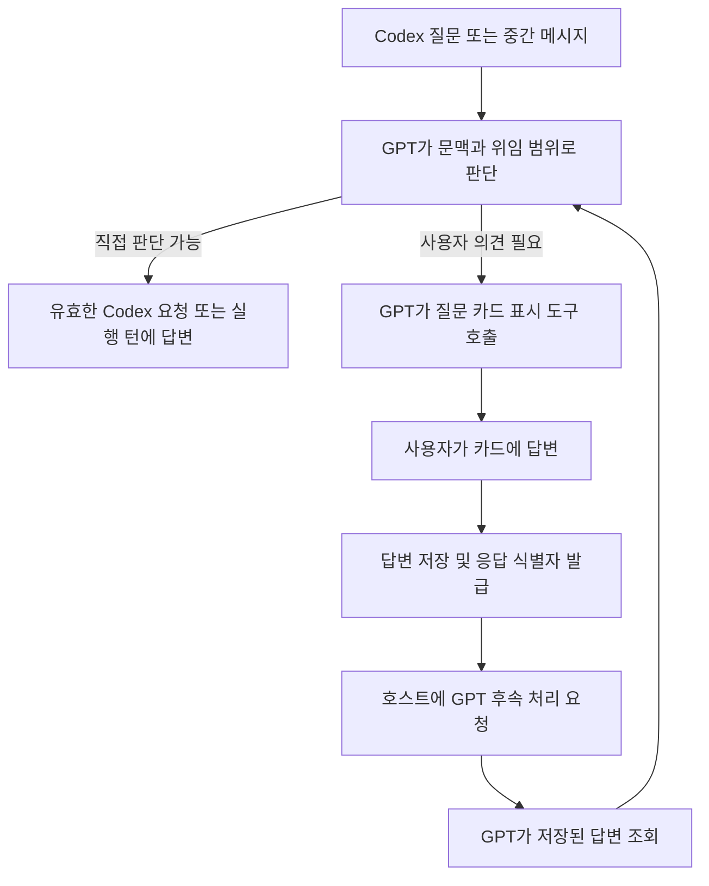

# GPT가 Codex 질문을 처리하고 사용자 질문 카드를 사용하는 구조의 기술 검토

검토일: 2026-09-07. **구현 가능하다.** 실제 Codex CLI 3종에 합성 질문을 생성하게 하고 프로그램이 답변을 보내, Codex가 선택한 답을 반영해 작업을 완료하는 것을 확인했다. 기존 카드 화면도 GPT가 요청한 사용자 의견을 받아 GPT에게 전달하는 용도로 재사용할 수 있다.

다만 현재 브리지는 이 전체 흐름을 제공하지 않는다. 특히 **구조화된 입력 요청과 일반 메시지로 전달되는 질문을 구분해야 하며, GPT가 질문을 읽고 응답하는 경로와 카드 제출 후 GPT가 처리를 재개하는 경로를 추가해야 한다.** 운영 브리지와 설정은 변경하지 않았다. 이번에 추가한 것은 조사용 스크립트·시제품·증거·이 보고서다.

## 직접 확인한 결과

| 검사 | 결과 | 검증 수준 |
| --- | --- | --- |
| 앱 내장 CLI 0.153.4 + GPT-6 Astra | 메시지형 질문 → 프로그램 답변 → 답변을 반영한 최종 응답 → turn 완료 | 실제 로그인·실제 CLI·실제 모델 |
| 터미널 CLI 0.153.3 + GPT-6 Astra | 같은 흐름 통과 | 실제 로그인·실제 CLI·실제 모델 |
| 브리지 관리 CLI 0.153.4 + GPT-6 Astra | 같은 흐름 통과 | 실제 로그인·실제 CLI·실제 모델 |
| 현재 MCP 계약과 GPT용 응답 시제품 | 조회·대기·권한 범위·질문 변경·중복 응답 등 11개 검사 통과 | 실제 브리지 MCP/작업 저장소, 합성 upstream·연구용 도구 |
| 기존 카드 화면의 GPT 전달 시제품 | 정상 제출, 전달 실패 후 재시도, 만료된 질문 거절 3개 통과 | 실제 Chromium, 기존 renderer, 모의 호스트·제출 처리 |
| 구조화된 비차단 질문 응답 회귀 검사 | 통과 | 기존 App Server 어댑터와 합성 JSON-RPC peer |
| 실제 ChatGPT가 새 도구를 골라 답하고 카드 제출 후 다시 실행 | 미검증 | 운영 도구·카드 계약을 추가하고 실제 호스트에서 확인 필요 |

세 CLI의 요청에 모두 같은 읽기 전용 임시 폴더·동일 모델·낮은 추론 설정을 사용했다. 기존 파일 로그인은 권한을 제한한 임시 Codex home에서 사용하고 검사 뒤 삭제했다. 실제 프로젝트 작업, 파일 변경 명령, 승인 요청의 수락은 수행하지 않았다. 기존 CLI 선택·저장된 권한 정책·서비스도 변경하지 않았다.

세부 결과와 생성된 입력 스키마는 [검증 JSON](2026-09-07-gpt-question-feasibility.json)에 있다. 인증 정보·계정 식별자·프로젝트 경로는 포함하지 않는다.

## 핵심 발견: 비차단 질문의 전달 형태가 하나가 아니다

### 1. 구조화된 질문

설치 CLI가 생성한 `ToolRequestUserInputParams`에는 필수 `isBlocking`, `threadId`, `turnId`, `itemId`, `questions`가 있다. 응답은 질문 ID별 답변 배열이다.

```json
{
  "answers": {
    "color": { "answers": ["Blue"] }
  }
}
```

이 응답을 만드는 주체가 반드시 사람의 클릭일 필요는 없다. 브리지 클라이언트가 유효한 요청에 해당 형식으로 응답하면 된다. 현재 어댑터의 `respondToInteraction`에도 이 경로가 있고, 비차단 합성 요청에 대한 답변 회귀 검사가 통과한다.

공식 변경 기록은 CLI 0.153.0의 구조화된 `request_user_input_async` 지원이 **모델 카탈로그에서 활성화되는 조건**을 갖는다고 설명한다. 따라서 CLI 버전 또는 `isBlocking` 스키마의 존재만으로 모든 모델에서 같은 질문 기능을 쓸 수 있다고 표시하면 안 된다. [공식 변경 기록](https://learn.chatgpt.com/docs/changelog)

공식 App Server 문서는 서버 요청이 처리되거나 정리되면 `serverRequest/resolved`가 전달된다고 설명한다. 설치 스키마에서는 `autoResolutionMs`가 deprecated로 표시돼 있다. 작업 진행 여부는 `isBlocking`으로 판단하고, 요청의 실제 유효성은 현재 pending 상태와 서버의 해결·종료 알림으로 확인해야 한다. [공식 App Server 문서](https://learn.chatgpt.com/docs/app-server#toolrequestuserinput)

### 2. 실제 계정에서 관찰한 메시지형 질문

현재 인증된 계정에서 가져온 GPT-6 Astra 카탈로그에는 `experimental_supported_tools`로 `send_user_message_async`, `clock`이 있었다. 시험 프롬프트는 구조화된 비동기 도구 사용을 요청했지만, 실제 wire에서는 `item/tool/requestUserInput` 서버 요청이 관찰되지 않았다. 대신 다음 순서의 메시지가 도착했다.

1. `item/completed`, `item.type=agentMessage`, `phase=final_answer`: “Which probe color?”와 Blue/Red 선택지.
2. 같은 실행 턴의 commentary: `PROBE_CONTINUES`.
3. 프로그램이 해당 실행 중인 턴에 `turn/steer`로 Blue 답변을 전달.
4. Codex의 최종 응답 `PROBE_ANSWER_Blue`와 `turn/completed`.

이 기록은 **메시지로 나온 질문에 프로그램이 답할 수 있다는 실제 증거**다. 특정 내부 질문 도구가 호출됐다는 증거로 확대 해석하지 않는다. 응답 없이 관찰한 별도 실행에서는 질문 뒤에도 commentary가 도착했고 검사기 제한 시간까지 턴이 열려 있었다.

브리지 어댑터를 사용하지 않는 직접 JSON-RPC 검사에서도 이 메시지 형태를 확인했다. 초기 두 검사가 구조화된 요청만 기다리다 150초 후 종료된 이유를 단순한 연결 실패나 어댑터의 질문 유실로 결론짓지 않았다. 인증·모델 조회·턴 시작은 성공했고, 현재 관찰한 질문의 전송 형태가 검사기의 기대와 달랐다. **150초는 검사기가 정한 종료 제한이며 CLI 질문의 자동 만료 시간은 아니다.**

또한 중간 질문에도 `phase=final_answer`가 붙었다. 메시지의 phase만 보고 작업 완료로 판정하면 안 된다. `turn/completed`와 정확한 turn ID를 기준으로 해야 한다.

| 관찰한 입력 형태 | 답변 경로 |
| --- | --- |
| 해결되지 않은 `item/tool/requestUserInput` 서버 요청 | 같은 요청의 JSON-RPC 응답으로 정확한 질문 ID에 답변 |
| 실행 중인 Codex가 일반 메시지로 물은 질문 | 현재 정확한 턴에 `turn/steer`로 GPT가 정리한 답변 전달 |
| 기존 질문의 턴이 이미 끝남 | 기존 요청에 재전송하지 않고 GPT가 현재 상태를 확인해 필요한 경우 명시적으로 이어가기 |

구조화된 승인·질문 요청을 `turn/steer`로 해결한 것으로 처리해서는 안 된다. 이번에 steer가 성공한 대상은 **해결할 서버 요청이 없는 합성 메시지형 질문**이었다.

## 현재 브리지에서 추가해야 하는 부분

| 현재 상태 | 필요한 변경 | 근거 |
| --- | --- | --- |
| `codex_interaction_respond`는 app-only이고 현재 카드 lease를 요구 | 일반 작업 질문에 대한 GPT용 응답 경로 추가, 승인 응답 경로와 분리 | `src/tools.ts`, 현재 도구 descriptor |
| 정확한 Job의 공개 `codex_status` 결과가 pending 질문·중간 메시지를 포함하지 않음 | GPT가 읽을 수 있는 질문 정보와 중간 메시지, 조회 cursor 제공 | `formatJobStatus`, `compactStatusProjection`, `statusItemProjection`; MCP 재현 |
| `waitFor=terminal`은 질문이 생겨도 완료/제한 시간까지 대기 | 질문 또는 판단할 입력이 생겼을 때 반환하는 대기 조건 추가 | 160ms 격리 대기에서 질문이 생겨도 timedOut=true 확인 |
| `waitFor=change`는 이용 가능하지만 진행 이벤트마다 반환 가능 | 입력 cursor로 이미 본 질문과 단순 진행 상황을 구분 | 격리 검사에서 unrelated progress도 대기를 깨움 |
| 카드 응답은 Job 전체의 `expectedJobVersion`과 일치해야 함 | GPT용 일반 질문에는 질문 자체의 revision·정확한 worker/turn/요청 identity를 검증 | 독립 작업 진행으로 Job 버전 3→4, 질문은 그대로인 상황 재현 |
| 일반 질문 카드가 Codex 요청에 직접 답함 | GPT가 카드 표시를 요청하고 카드 제출은 사용자 답변 레코드에 저장; GPT가 읽어 Codex에 전달 | 기존 renderer를 바꾼 로컬 시제품에서 검증 |
| 기존 자동 handoff는 완료 outbox와 현재 자동 Activity 카드에 연결 | 질문/답변 통지와 소비 상태를 별도로 관리 | `completion_outbox`, `dispatchHandoffs` 구현 |
| 모델 정보 투영이 비동기 질문 도구 정보를 보존하지 않음 | 모델별 지원 여부와 실제 관찰한 입력 형태를 구분해 노출 | `src/modelCatalog.ts`, 실제 카탈로그 및 wire 관찰 |

연구용 `probe_answer` 도구는 실제 브리지의 MCP 서버에 격리해서 등록했다. 현재 질문의 token을 검증하고 일반 진행 때문에 Job 버전이 바뀌어도 같은 질문에 답할 수 있었다. 다른 scope, 변경된 질문 token, 이미 해결된 요청은 거절했고 같은 요청의 재시도는 한 번만 전달했다. 이 도구는 합성 질문 한 종류만 처리하며 **운영에 사용할 완성된 응답 API가 아니다.** 일반화할 때에는 동시 응답 직렬화, worker 교체, 사용자 취소, 정책 경계의 원자적 검증을 유지해야 한다.

## 질문 카드를 GPT용 도구로 사용하는 설계



질문 카드는 Codex 요청과 별도의 수명을 가져야 한다. GPT가 자체적으로 물은 질문이나 여러 작업의 질문을 합친 경우도 지원하기 위해서다. 기존 폼 renderer를 재사용하되 질문 표시·제출 계약은 별도로 두고, 다른 Activity 카드의 작업 감시나 handoff 소유권을 빼앗지 않도록 한다.

필요한 기능은 다음과 같다. 이름과 도구 개수는 구현 시 현재 공개 계약에 맞춰 확정할 수 있다.

- **Codex 입력 조회:** 같은 대화의 정확한 작업에서 pending 질문과 필요한 중간 메시지를 반환한다. 비공개 추론은 포함하지 않는다.
- **GPT의 Codex 응답:** 구조화된 일반 질문은 전용 응답으로, 메시지형 질문은 기존 `codex_steer`로 전달한다. 요청이 끝났다면 명시적인 만료/종료 결과를 반환한다.
- **GPT의 사용자 질문 표시:** GPT가 질문·설명·선택지를 작성하고 선택적으로 원래 작업/질문을 연결한다. 표시 자체로 Codex에 응답하지 않는다.
- **카드 답변 제출과 GPT 조회:** 제출은 답변을 저장하고 식별자를 돌려준다. GPT는 그 식별자로 같은 scope의 실제 답변을 읽는다.

카드의 `tools/call`과 GPT에게 후속 메시지를 요청하는 `ui/message`는 역할이 다르다. 카드 내부 도구 호출만으로 GPT가 반드시 실행된다고 가정하면 안 된다. OpenAI의 공식 UI 지침은 데이터 도구와 표시 도구를 분리하는 흐름, 그리고 `ui/message`와 `sendFollowUpMessage`의 대응을 설명한다. [공식 UI 구현 문서](https://developers.openai.com/plugins/build/chatgpt-ui)

후속 메시지에는 응답 식별자와 짧은 완료 사실을 보내고, GPT가 조회 도구로 답변을 읽게 하는 편이 적절하다. 카드의 비공개 `_meta`는 모델이 읽는 데이터 통로가 아니므로 답변을 그곳에만 넣으면 안 된다. 표준 MCP Apps 메서드를 우선하고, 해당 호스트가 제공하는 OpenAI 확장은 기능 확인 뒤 사용할 수 있다. [공식 UI reference](https://developers.openai.com/plugins/reference#windowopenai-component-bridge)

### 카드 시제품에서 확인한 경계

기존 `ACTIVITY_CARD_HTML`을 메모리에서 복사하고 제출 함수만 연구용으로 바꿨다. 기존 소스·배포용 카드 리소스는 수정하지 않았다.

- 정상 제출: 답변은 한 번 저장되고 GPT 전달 요청이 한 번 발생했다. Codex 직접 응답 호출은 0회였다.
- 후속 전달 실패: 답변을 다시 저장하지 않고 같은 식별자로 사용자가 전달을 재시도했다. 저장 1회·전달 시도 2회였다.
- 질문 만료: 답변 저장과 후속 전달 모두 발생하지 않았다.

실제 Chromium에서 실행했지만 저장·호스트 응답은 모의 구현이다. 따라서 이는 카드 재사용과 클라이언트 흐름의 증거이며, ChatGPT가 실제 모델 턴을 시작했다는 증거는 아니다. `output/playwright/question-gpt-card-probe/`에 화면과 결과가 있다.

## 구현 시 해결해야 하는 실제 제약

**GPT가 실행 중일 때와 응답 턴을 끝낸 뒤는 다르다.** 실행 중에는 bounded status wait에서 입력을 반환하고 GPT가 다음 도구를 호출하는 구조를 만들 수 있다. 응답 턴이 끝났다면 호스트가 후속 처리를 시작해야 한다. 공식 UI의 후속 메시지 API는 이용 가능한 수단이지만, 닫힌 대화·해제된 카드에서도 항상 GPT가 자동으로 실행된다는 보장은 이번 조사에서 확인하지 못했다. [공식 후속 메시지 API](https://developers.openai.com/plugins/reference#capabilities)

**카드 답변의 저장 성공과 GPT의 처리 완료는 별도 상태다.** 제출 성공, 호스트 전달 요청, GPT 조회, Codex 응답을 구분해야 한다. 호스트 전달 실패 시 이미 받은 답변을 잃거나 Codex에 중복 전송해서는 안 된다. 실제 호스트가 요청을 거절하면 다른 경로로 자동 우회하지 않고 그 상태를 표시해야 한다.

**답변 보관 정책을 명시해야 한다.** 현재 Codex interaction의 원문 답변은 브리지에 저장하지 않는다. GPT가 나중에 사용자 카드 답변을 읽게 하려면 별도 수명·보관 기간·삭제 기준을 가진 레코드가 필요하다. 메모리에만 두면 프로세스 재시작 시 잃는다는 한계를 표시해야 한다. 인증 비밀은 일반 질문 카드의 답변 통로로 옮기지 않는다.

**GPT의 판단 권한과 승인 권한은 구분한다.** 기존 scope·프로젝트·권한 상한 검사는 유지한다. `requestUserInput`이 외부 앱 승인에도 사용될 수 있으므로, 메서드 이름만 보고 모든 입력을 GPT 자동 응답 대상으로 열 수 없다. 입력의 출처와 연결된 실행 항목을 확인해야 한다. [공식 앱 도구 승인 계약](https://learn.chatgpt.com/docs/app-server#mcp-tool-call-approvals-apps)

## 구현 순서와 완료 기준

1. 공개 조회 결과에 입력과 중간 메시지를 추가하고 질문 도착 시 GPT의 상태 대기가 반환되도록 한다. 카드가 표시되지 않는 설정에서도 실행 중인 GPT가 입력을 받을 수 있어야 한다.
2. 일반 구조화 질문의 GPT 응답 계약을 추가한다. 메시지형 질문에는 기존 `codex_steer`를 사용한다. 진행 이벤트와 답변의 경합, 동일 응답 재시도, 질문 만료, worker 재시작을 검증한다.
3. 카드 renderer를 재사용하는 GPT 질문 도구와 사용자 답변 레코드를 추가한다. 제출이 Codex에 직접 답하지 않고 GPT에게 반환되는 것을 검증한다.
4. 실제 ChatGPT에서 질문 카드 열기 → 사용자 제출 → GPT 재개 → 답변 조회 → Codex 반영을 검증한다. 전달 실패·대화 재열기·오래된 카드·다른 대화 범위도 포함한다.

위 1–3의 구현 가능성은 프로토콜과 로컬 시제품으로 확인했다. **제품 완료 판정에는 4의 실제 호스트 검증이 필요하다.** 운영 환경에서 이 기능이 이미 작동한다고 표시할 수는 없다.

## 재현 스크립트

```sh
# 실제 CLI에서 메시지형 질문을 관찰하고 답변한다.
npx tsx scripts/probe-question-cli-wire.ts --run-authenticated \
  /absolute/path/to/codex --reply-to-message --source=app

# 현재 MCP 계약의 공백과 격리된 GPT 응답 시제품을 검사한다.
npx tsx scripts/probe-question-bridge-contract.ts

# 기존 카드 renderer를 사용한 GPT 전달 흐름을 Chromium에서 검사한다.
npx tsx scripts/probe-question-card-browser.ts
```

`scripts/probe-gpt-question-feasibility.ts`는 구조화된 요청만을 기대했던 최초 가설의 검사기다. 현재 계정의 메시지형 동작에서는 제한 시간으로 종료되며, 그 실패를 포함해 증거를 보존했다. 실제 로그인 검사는 명시적 `--run-authenticated` 옵션이 필요하다. 모든 검사기는 운영 CLI 파일·설정·서비스를 변경하지 않는다.
