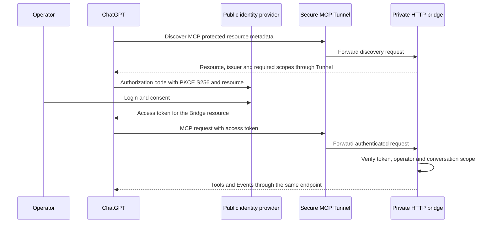

# Authenticated ChatGPT / Tunnel connection for MCP Events

## Decision and current status

The product connection selected for [issue #213](https://github.com/menaje/codex-mcp-bridge-for-chatgpt/issues/213)
is **user OAuth 2.1 through a private HTTP Secure MCP Tunnel**. An established
identity provider issues access tokens; the bridge verifies them and binds a
stable operator principal to Jobs, subscriptions and approved followups.

This is a connection design, not an implemented setup option. As of 2026-10-01,
the operator has no existing OAuth/OIDC provider. Provider selection and its
configuration must precede the bridge adapter and actual host acceptance.
Issue #213 remains open. The default launcher still uses No Auth, and Events
on that connection are denied. The existing isolated static-bearer HTTP tests
remain valid bridge tests, not evidence of a supported ChatGPT login path.

OpenAI documents OAuth 2.1 authorization-code with PKCE `S256` for authenticated
MCP connections. ChatGPT cannot present a customer-defined API key. Adding the
installation bearer to a Tunnel profile therefore does not establish the
documented product connection. See [OpenAI authentication](https://developers.openai.com/plugins/build/auth).

The [Secure MCP Tunnel guide](https://developers.openai.com/api/docs/guides/secure-mcp-tunnels)
supports OAuth discovery through the tunnel while the MCP server stays private.
The authorization server is not automatically tunneled: its discovery, browser
login and token endpoints must be reachable from the public internet and the
tunnel-client host. This design uses the private developer-mode connection;
public plugin distribution has a separate public-HTTPS endpoint requirement.

## Roles and credentials

This is the intended flow after implementation. Tunnel workspace association
and its control-plane runtime key authorize the transport. They are separate
from the user's OAuth token and do not supply a verified end-user principal to
the bridge. Callback challenge verification establishes callback control, not
user identity. `openai/session`, `openai/subject` and organization metadata
remain correlation values. A published OpenAI client certificate or OAuth
client registration identifies the client application, not the operator.

The bridge remains a service for one trusted operator. It must accept only the
configured verified issuer/subject pair, along with the resource audience and
required Bridge scope. This work does not introduce multi-user project sharing.
The Codex login used to execute a Job is a separate credential. [Issue #214](https://github.com/menaje/codex-mcp-bridge-for-chatgpt/issues/214)
concerns execution-provider subscription authentication, not the MCP subscriber
identity, and is not a prerequisite for this OAuth connection.

## Configuration required before implementation acceptance

No provider, tenant, issuer or login has been provisioned. The following are
configuration inputs to the future adapter, not environment variables accepted
by the current release.

| Input | Required configuration and evidence |
| --- | --- |
| Identity provider | An established provider with public HTTPS OAuth/OIDC discovery, authorization-code flow, advertised PKCE `S256`, and authorization/token endpoints reachable by the required clients. Select by these capabilities; no vendor or account is chosen yet. |
| Exact issuer | One canonical issuer string, identical in provider discovery and the bridge's `authorization_servers` metadata. Preserve paths, case and trailing slashes exactly. |
| MCP resource / audience | One canonical HTTPS resource identifier, echoed in authorization and token requests and bound into the access token audience. Capture the actual ChatGPT/Tunnel discovery and challenge URLs before configuring it; do not guess a Tunnel URL or use the local HTTP forwarding address. |
| Operator and permission | The provider's verified stable subject for the permitted operator and an enabled Bridge API scope. The initial adapter should retain the existing `bridge` permission. An email, OAuth client ID or caller-supplied subject is insufficient. |
| Client registration | Prefer Client ID Metadata Documents (CIMD) when supported. DCR or a predefined OAuth client are also documented paths. Record the selected method and token-endpoint authentication method. |
| Redirect and client metadata | Copy the exact redirect URI and, for CIMD, client metadata URL shown on the actual ChatGPT connection management page. Stable redirects depend on provider support for RFC 9207 issuer identification; do not construct or guess them. |
| Token validation | Record whether access tokens are JWTs or opaque. Use the provider's supported verification method: signature validation against trusted JWKS, or authenticated introspection with an active token and validated resource, scope and subject. An OIDC ID token is not a Bridge access token. |
| Renewal and revocation | Define token lifetime, refresh/reauthorization, operator revocation and a finite subscription grant policy. JWT validation by itself cannot prove immediate remote revocation. Advertised OIDC scopes must also be enabled for the chosen client. |
| Tunnel | Use a dedicated authenticated HTTP profile and the intended ChatGPT workspace association. Keep the control-plane runtime key separate from OAuth credentials. Verify metadata discovery through the actual connection. |
| Local sealing key | Keep a stable installation-owned secret outside SQLite for callback URL/signing-secret encryption. OAuth access tokens rotate and must not become the database encryption key. |

For CIMD, OpenAI documents `none` and `private_key_jwt` as supported token
endpoint client authentication methods. The latter is client identification
during authorization-code exchange; it is not permission to replace user login
with a machine-to-machine JWT bearer grant. OpenAI does not support that grant,
client credentials, service accounts or customer-defined API keys for this path.
These requirements come from [OpenAI's authentication contract](https://developers.openai.com/plugins/build/auth).

## Minimum bridge implementation

Once a provider and the values above are selected, implement the following
bounded changes against the existing architecture:

1. Add an explicit HTTP OAuth mode in configuration and `src/server.ts`. Serve
   protected resource metadata and a proper `401` Bearer challenge carrying
   `resource_metadata`. Verify each access token before MCP dispatch. Reject
   missing, invalid, expired, wrong-issuer, wrong-audience, missing-scope and
   non-operator tokens. Keep the existing Host and Origin boundary. Use a
   maintained verifier for the selected provider instead of creating an
   authorization server inside the bridge.
2. Carry a dedicated verified principal from middleware into
   `authenticatedMcpPrincipal()` and the existing task/scope checks. Derive it
   from the configured resource and verified issuer/subject, using an unambiguous
   stable encoding. Do not derive it from token bytes, expiry, JWT ID or OAuth
   `client_id`. The current bearer implementation puts its private operator
   identifier in SDK `AuthInfo.clientId`; a standard OAuth client's ID cannot
   be reused as the user's principal.
3. Adapt `McpEventsController` to authorize the configured operator principal
   independently of the current installation-bearer hash. Separate
   `EventDestinationVault` key ownership from short-lived access tokens.
   Preserve exact Job/scope/Activity/Agent checks, callback verification, the
   terminal-result transaction, receipt identity and retry/retention behavior.
4. Bound subscriptions by the explicit authorization grant policy. If only
   access-token expiry is verified, cap the grant to that expiry. Renewal by
   the same verified user must preserve the logical subscription and followup
   identities. Expiry or revocation stops delivery without cancelling Codex,
   rerunning a Job or releasing the retained result early.
5. Add an opt-in authenticated HTTP launcher/profile path in
   `scripts/start-codex-mcp-bridge.mjs`, which currently forces No Auth. Its
   managed profile identity must distinguish authentication configurations.
   Explicit OAuth plus stdio must fail clearly until there is a verified stdio
   identity contract; it must never silently start No Auth.
6. Exercise these changes through the real HTTP MCP handler with an isolated
   test authorization server and temporary state. Cover invalid tokens,
   foreign users, token renewal, discovery/challenges, grant expiry, restart,
   callback access and concurrent repeated B admissions. Synthetic provider
   tests do not replace actual ChatGPT login and Events acceptance.

The adapter must not rewrite existing Job principals or approval receipts when
switching authentication modes. A new OAuth-authenticated A is required for the
first trial. Retained No Auth or static-bearer Jobs cannot gain OAuth ownership
just because the same local operator enables the new mode. Any later migration
needs its own explicit ownership and sealing-key recovery design.

The system-issued `followupId` and canonical `requestId` contract from `7090cf1`
stays in place. Neither a login nor an event creates approval for B, and no
separate workflow or review engine is needed.

## Actual acceptance sequence

Use an isolated bridge/database and a harmless fixture project after the
adapter exists. Record transport, authentication and host behavior separately.
The sequence follows [connect and test](https://developers.openai.com/plugins/deploy/connect-chatgpt)
and the [MCP Events contract](https://developers.openai.com/plugins/build/mcp-events).

1. Capture protected resource metadata as seen through Tunnel, provider
   discovery, exact resource/audience, client registration and redirect. A
   healthy Tunnel or successful metadata doctor check alone does not prove
   user authentication.
2. Complete operator login in ChatGPT. Prove that the bridge accepts the valid
   token and rejects missing/wrong-user tokens. Capture only redacted outcomes
   and principal references, never tokens or login secrets.
3. Admit A with an exact pre-approved B prompt through the authenticated
   connection. Discover/list/subscribe to its terminal event on the same
   authenticated endpoint, with the original conversation scope. Observe the
   callback challenge and committed subscription before waiting for A.
4. Record terminal commit and callback receipt separately. In the actual
   resumed conversation, GPT retrieves A's exact result and current version,
   reviews it, and requests B using the bridge-issued followup reference.
   Confirm one admitted B and one upstream execution when two GPT invocations
   or repeated events request that same reference.
5. Include an A with no approved B, foreign-scope reuse and changed-prompt
   controls. Token renewal and bridge restart must preserve the verified
   principal and references. Expiration/revocation must block delivery according
   to the documented grant policy without creating new work.
6. Test card closure, conversation switching, backgrounding and connectivity
   loss separately. Record the actual Chat model, Pro/usage behavior and
   limitations; webhook `2xx` is not evidence of preserved mode or GPT review.

The completed item in this phase is the official connection design. Provider
configuration, the OAuth adapter, synthetic adapter validation and actual host
acceptance remain pending. [The investigation record](audits/2026-10-01-issue-213-auth-connection.md)
separates source evidence from installed-product acceptance.
