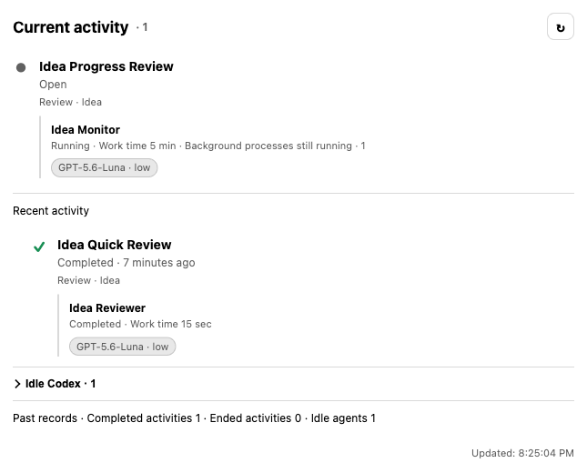

# Setup and settings

This guide covers the user-facing setup for Codex MCP Bridge for ChatGPT. Choose the path that matches the computer that will actually run Codex.

Official background:

- [Codex App Server](https://learn.chatgpt.com/docs/app-server)
- [Secure MCP Tunnel](https://developers.openai.com/api/docs/guides/secure-mcp-tunnels)
- [Connect an MCP app to ChatGPT](https://developers.openai.com/plugins/deploy/connect-chatgpt)

## Choose a setup path

| Computer and role | Setup path |
| --- | --- |
| Apple Silicon or Intel Mac running Codex | [macOS server mode](#macos-server-mode) |
| Mac monitoring and configuring another server | [macOS client mode](#macos-client-mode) |
| Windows or Linux running Codex | [Node.js server](#nodejs-server-on-windows-or-linux) |
| Mac managed entirely from a terminal | [Node.js server](#nodejs-server-on-windows-or-linux) |

Only the server computer runs the Bridge, Secure MCP Tunnel, and Codex. A macOS client connects to one saved server at a time and does not start those services locally.

## What you need

For a server computer:

- Node.js 22 or later
- Codex CLI installed and authenticated
- `tunnel-client`
- an OpenAI Secure MCP Tunnel
- the Tunnel runtime API key and Tunnel ID
- at least one existing project folder for Codex work
- ChatGPT Developer mode and permission to add the connection

For a client-only Mac:

- macOS 13 or later
- the native Codex MCP Bridge for ChatGPT app
- network access to the server over a private LAN or private VPN
- a fresh one-time pairing invitation copied from the server

A client-only Mac does not need a local Node.js, Codex CLI, Tunnel runtime key, or Tunnel ID for remote operation.

## macOS server mode

### 1. Install the app

Download the architecture-specific DMG from [GitHub Releases](https://github.com/menaje/codex-mcp-bridge-for-chatgpt/releases):

- `arm64`: Apple Silicon Macs
- `x64`: Intel Macs

Move the app to Applications before enabling launch at login. The current build is ad-hoc signed and not notarized. If macOS blocks the first launch, open **System Settings → Privacy & Security** and approve this app once.

### 2. Select the server role

Open the app and keep **Run Server on This Mac** selected in **Settings → Connection**. In this role, the app owns the per-user helper, Bridge, Secure MCP Tunnel, and Codex runtime.

Closing the popover or Settings window does not stop the server. Choosing **Quit App** stops the app-managed server after checking for active work.

<p align="center">
  
</p>

### 3. Connect the Secure MCP Tunnel

The first-run connection screen checks the default private configuration:

```text
~/.config/codex-mcp-bridge/.env
```

If an existing valid configuration is found, the app reuses it without displaying the secret. Otherwise:

1. Use **Create Runtime API key** and **Create Tunnel** to open the corresponding OpenAI Platform pages.
2. Enter the Tunnel runtime API key and Tunnel ID. The Tunnel ID starts with `tunnel_`.
3. You may paste text containing both values and let the app extract them.
4. Select **Save and Connect Safely**.

The app stores these values only in the private runtime file. It does not move them into the macOS Keychain. The file must remain outside every registered project folder.

### 4. Sign in to Codex

The Tunnel credential and Codex login are separate:

- the Tunnel runtime key connects the Bridge to the Secure MCP Tunnel;
- `codex login` authorizes the Codex CLI that performs project work.

If the app says Codex login is required, select **Start Codex Browser Login** and complete the browser flow. The app continues checking until the CLI reports a successful login. It does not sign you out or replace an existing Codex credential.

### 5. Register a project

Open **Settings → Projects**, select **Add Project**, and choose an existing folder. The app registers the folder but never moves or deletes it.

There is no implicit default project. ChatGPT must select an exact registered project for each new Activity or fresh Agent context. This prevents work from starting in an unintended folder.

### 6. Confirm readiness

The menu-bar status distinguishes normal startup from a failure:

- **Checking connection**: the helper or Tunnel is still becoming ready;
- **Ready/Connected**: the Bridge and Tunnel are available;
- an orange or red message: follow the displayed recovery action or open the diagnostic logs.

## Connect the server to ChatGPT

Once the server reports that the Bridge and Tunnel are connected:

1. Open ChatGPT Settings and enable Developer mode.
2. Create a developer-mode connection.
3. Choose Secure MCP Tunnel and select the Tunnel ID configured on the server.
4. Choose **No Auth**. The loopback Bridge and Secure MCP Tunnel provide the transport boundary.
5. Open the connection in a new ChatGPT conversation.
6. Ask ChatGPT to open **Codex MCP Bridge for ChatGPT settings** or **Codex Dashboard** to verify the connection.

Refresh the ChatGPT connection after installing a Bridge release that changes its tools or cards. A normal app, server, Tunnel, or computer restart with the same build does not require Refresh.

The Activity card keeps running and recently completed Agents together without exposing local project paths:

<p align="center">
  
</p>

## macOS client mode

Client mode lets a Mac view the Dashboard and change shared settings on a server Mac without running another Bridge, Tunnel, or Codex process locally.

### 1. Prepare the server Mac

On the Mac already running the server:

1. Open **Settings → Connection**.
2. Enable **Manage This Server from Another Mac**.
3. The app fills in the current Mac name and a local HTTPS address automatically.
4. Use **Advanced Connection Settings** only when a private DNS or VPN address is required.
5. Select **Create and copy a new pairing invitation valid for 5 minutes**.

The invitation is the only value to copy. Do not copy the server address, server ID, or certificate fingerprint separately. The invitation includes them together, expires after five minutes, and works once.

<p align="center">
  
</p>

### 2. Pair the client Mac

On the client:

1. Open **Settings → Connection**.
2. Select **Connect to Existing Server**.
3. Paste the invitation.
4. Enter a name that lets the server owner recognize this client device.
5. Verify and register the server, then confirm the switch to client mode.

If the client Mac was previously running its own server, the app first finishes or explicitly stops its local work before changing roles.

### 3. Use and switch saved servers

The client can retain multiple paired server profiles, but exactly one is active. Select a saved server from Connection settings or the menu-bar server picker to switch.

After switching:

- Dashboard data comes only from the newly selected server;
- General and Projects settings change that server;
- project paths refer to folders on that server, not the client Mac;
- quitting the client app never stops the remote server.

To add another server, use **Pair New Server**. The new-pairing form is hidden during ordinary use and appears only when there is no saved server or when you explicitly choose to add one.

### 4. Network and revocation

The server address must be reachable from the client. The app does not configure routers, public DNS, port forwarding, firewalls, or VPNs. Use this feature only on a private LAN or private VPN you control.

The client pins the server certificate and server ID from the invitation. The client credential is stored in that Mac's protected credential store. If a client is lost or should no longer connect, revoke it from the server's **Connection → Registered Devices** section.

See [Remote client mode](remote-client.md) for the complete security and lifecycle boundary.

## Node.js server on Windows or Linux

There is currently no native Windows or Linux app. These systems run the same Bridge as a Node.js service, while user settings and status remain available through the ChatGPT Settings and Dashboard cards.

The following source installation works for a terminal-managed server:

```bash
git clone https://github.com/menaje/codex-mcp-bridge-for-chatgpt.git
cd codex-mcp-bridge-for-chatgpt
npm ci
npm run build
```

Confirm Codex is available and sign in:

```bash
codex --version
codex app-server --help
codex login
```

### Linux or terminal-managed macOS configuration

Create a private runtime configuration outside all project folders:

```bash
mkdir -p "$HOME/.config/codex-mcp-bridge"
chmod 700 "$HOME/.config/codex-mcp-bridge"
cp .env.example "$HOME/.config/codex-mcp-bridge/.env"
chmod 600 "$HOME/.config/codex-mcp-bridge/.env"
```

Edit the file and set:

```dotenv
CONTROL_PLANE_API_KEY=sk-your-runtime-key
CONTROL_PLANE_TUNNEL_ID=tunnel_your_32_character_id
```

### Windows PowerShell configuration

Create the corresponding configuration under your user profile:

```powershell
$bridgeConfigDirectory = Join-Path $HOME ".config\codex-mcp-bridge"
New-Item -ItemType Directory -Force $bridgeConfigDirectory
Copy-Item .env.example (Join-Path $bridgeConfigDirectory ".env")
notepad (Join-Path $bridgeConfigDirectory ".env")
```

Set the same two `CONTROL_PLANE_*` values and save the file. Windows does not use the Unix `chmod` commands.

### Start the Node.js server

From the repository directory:

```bash
npm run bridge:secure
```

Keep the process running, or place it under a service manager appropriate for the operating system. Then complete [Connect the server to ChatGPT](#connect-the-server-to-chatgpt).

For loopback-only development without ChatGPT Tunnel access:

```bash
npm run bridge:local
```

The native remote-client listener and pairing UI are macOS-app features. A Windows or Linux Node.js server is normally managed through its terminal and the ChatGPT cards.

## Settings reference

Settings belong to the active Bridge server and are shared by every ChatGPT conversation using it. Ordinary General settings save automatically. Project operations apply immediately. Server settings use an explicit save because they restart the runtime.

### Connection

Connection settings choose the role of the current Mac:

- **Run Server on This Mac** starts and owns the local helper, Bridge, Tunnel, and Codex runtime.
- **Connect to Existing Server** starts none of those services and targets one paired server.
- **Launch Menu Bar App at Login** is always local to the current Mac and does not control whether the background server remains running.
- **Manage This Server from Another Mac** enables the private-network listener used by native clients.
- Pairing invitations register a new client device; Registered Devices can be revoked individually.

### General: access policy

The access strategy is the default requested for new work:

- **Read only**: every new task is limited to inspection.
- **Per task**: a task may request a level within the server's allowed range.
- **Always full access**: every new task requests full filesystem and network access.

This choice cannot exceed **Server → Maximum Allowed Access**. For example, selecting Always Full Access while the server ceiling is Read Only still produces read-only work.

### General: model policy

- **Fixed** chooses one model and reasoning level for new work.
- **Automatic** lets ChatGPT choose from either the visible catalog or an explicit allowlist.
- **Allow Ultra reasoning and sub-agent delegation** exposes Ultra where supported and permits delegated sub-agents.
- **Fast mode** requests faster processing for supported models. The model and reasoning level stay the same; usage or costs may increase. Its localized lightning badge appears beside the execution's model and effort in the menu bar and cards.
- **Refresh model list** reloads the currently available catalog.

Existing Agents keep execution context according to their continuation rules. Model availability can change with the installed Codex version and service catalog.

### General: model descriptions

In Automatic mode, **Model descriptions** shows the official description of
each model. Select **Edit** to adjust the text ChatGPT uses when choosing a
model, then **Save description** or **Cancel**. This editor uses explicit save
in both the native app and the ChatGPT Settings card.

Saved text has a **User description** label. **View official description** shows
the current official text, and **Use official description** removes your
override. Saving empty text also restores it. The official model list keeps its
existing refresh behavior. Switching to Fixed retains your descriptions for
later use; a model temporarily missing from the list also keeps its saved text.

### General: display and execution

- **App and card language** applies one explicit language to both surfaces. Automatic follows the Mac language in the app and the ChatGPT display language in cards, so they may differ.
- **Concurrent Agent jobs** limits how many jobs may run at once; it is not the number of registered Agents.
- **Keep new Agent tasks in the Codex app** preserves eligible new App Server threads in Codex. It does not change older tasks.
- **Activity card visibility** chooses Always, Background only, or Never.
- **Hand Off to ChatGPT After Completion** can automatically resume the ChatGPT-side flow while a qualifying Activity card is mounted.

Values above the normal concurrency range can increase CPU, memory, and API usage substantially.

### Projects

Each project has a display name and an existing absolute folder on the server computer. The Bridge validates the folder before admitting new work.

- Renaming a project changes only its display name.
- Relocating changes the registered folder without moving files.
- Archiving hides it from new task selection while preserving history.
- Restoring makes the same project identity selectable again.
- Deleting a registration never deletes the actual folder or prior work records.

When settings are opened from a remote client, enter the absolute path as it exists on the selected server.

Do not place `.env`, credentials, or other common secret files inside a registered project. The Bridge intentionally blocks common secret filenames before starting work.

### Server

The Server tab is available only on the Mac that owns the local server:

Codex execution uses the selected CLI through App Server. **Maximum Allowed Access** sets the server ceiling: Read Only, Workspace Write or Full Access. Changing it safely drains active work and restarts the server.

Installation, updates, authentication and migration from earlier releases are described in [Codex installations and updates](codex-runtimes.md).

## Where data is stored

Default server files are per-user:

```text
~/.config/codex-mcp-bridge/.env       Tunnel runtime configuration
~/.codex-mcp-bridge/state.sqlite      Settings, projects, Agents, Activities, and jobs
```

The macOS app also uses private helper/runtime files and, when remote management is enabled, a server identity and device registry. See [Native macOS app](macos-app.md#local-files-and-interfaces) and [Remote client mode](remote-client.md#server-files-and-lifecycle) for exact paths and permissions.

## Troubleshooting

### The app stays on Checking connection

This is normal briefly while the helper and Tunnel establish their control-plane connection. If it changes to an error, use the recovery action shown by the app and inspect **Diagnostic Logs**.

### Codex login is required even though the Dashboard has usage data

Bridge status and previously available usage information can load independently from the current Codex CLI authentication check. Complete **Start Codex Browser Login**, then select **Refresh Status** if the result does not update.

### A client cannot reach the server

Confirm that:

- remote management is enabled and the server app is running;
- both Macs can reach the advertised private address and port;
- the firewall or VPN allows that connection;
- the invitation is fresh and has not already been used;
- the server certificate or identity was not replaced after pairing.

### A project cannot be selected

The folder must exist on the server, be registered and active, and remain reachable under its saved absolute path. A remote client's local filesystem is never used to resolve a server project.

### ChatGPT still shows an older card or tool list

Install and start the new Bridge release first, then use Refresh on the ChatGPT developer-mode connection. Do not Refresh solely for a routine restart with the same build.

For advanced contract checks and operator diagnostics, continue with [ChatGPT integration](chatgpt-setup.md). For trust and exposure decisions, read the [security model](security.md).
